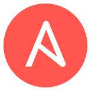
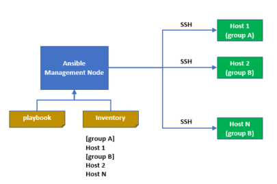

         

# Welcome to the HPE Developer Hack Shack
[HPE Developer Community Team](https://hpedev.io)

<p align="center">
  
  
</p>

# HPE Developer Workshop

 

# Ansible101: A simple Introduction to Ansible Concepts

Gone are the days when an administrator could, realistically, count the number of machines they were responsible for, and the days of very large scale deployments are here. This also means gone are the days when an admin could reasonably log into all of those machines to do the configuration by hand. Today it's best to rely on an automation framework to do this on a larger, more replicable, scale. Ansible is one such automation framework and this is a intended to walk folks through the very basics of Ansible, getting it set up, up and running, passing data, fetching information and generally getting comfortable with the basics of what configuration management is.

In a nutshell, Ansible is an open-source software:
* configuration manager
* simple
* extensible via modules
* written in python
* broad community
* many external tools
* playbook repository
* used by openstack, openshift & tonns of project

It supports devices and things you wouldn’t expect:
* Servers, Switches and Routers (HPE, Aruba, Cisco, Arista, Dell)
* VMware
* Storage devices (HPE, Netapp, Pure Storage, etc)

We won't be covering the installation part of Ansible in this workshop.
If you are willing to perform the ansible packages installation, you can either use regular distribution package mechanism or pip. Both will provide you with the necesarry packages to run you own tests.

# Ansible Architecture

Ansible is a radically simple IT automation engine that automates cloud provisioning, configuration management, application deployment, intra-service orchestration, and many other IT needs.
Being designed for multi-tier deployments since day one, Ansible models your IT infrastructure by describing how all of your systems inter-relate, rather than just managing one system at a time.
It uses no agents and no additional custom security infrastructure, so it’s easy to deploy - and most importantly, it uses a very simple language ([YAML](https://www.cloudbees.com/blog/yaml-tutorial-everything-you-need-get-started), in the form of Ansible Playbooks) that allow you to describe your automation jobs in a way that approaches plain English.

 


If you want to see more ansible related workshops, take a look at the following:
* [Using the iLO Redfish API with Ansible and OneView](https://hackshack.hpedev.io/workshop/23)


# Authors:[Frederic Passeron](mailto:frederic.passeron@hpe.com)  and  [Bruno Cornec](mailto:bruno.cornec@hpe.com)

## Handouts
You can freely copy the Jupyter Notebooks, including their output, in order to practice back at your office at your own pace, leveraging a local installation of Jupyter Notebook on your laptop.
- You install the Jupyter Notebook application from [here](https://jupyter.org/install). 
- A Beginners Guide is also available [here](https://jupyter-notebook-beginner-guide.readthedocs.io/en/latest/what_is_jupyter.html)


## Lab flow
HPE Developer Workshops-on-Demand are delivered through a central point that allows a portable, dynamic version of the lab guides. Rather than using standard PDF files which always end in copy / paste errors from the lab guide into the TS sessions, this year we decided to innovate and introduce a brand-new infrastructure. We will leverage a JupyterHub server on which all the different lab guides will be stored in a notebook format (*.ipynb).

In a nutshell, a notebook works as follows:

• A Notebook is a series of cells

• A Notebook uses a kernel (visible in the upper right corner of the Notebook)

• Cell can be Markdown or Code (in the selected kernel)

• To Run a cell use:

    o The Play Button at the top
    o Ctrl-Enter (run and stay on same cell)
    o Shift-Enter (run and move to next cell)
    
• Running a markdown cell is just rendering it

• Running a Code cell runs the code and display the output just below the cell

• When a cell is running it displays a [*] to its left, then when finished, it displays a counter of the number of execution of that cell

• You cannot run a cell when another is already running but you can interrupt a running cell with the stop button

Enjoy the labs ! :-)


## Workflow

### Lab 1: Inventory, Playbooks, and Tasks
Description: In this section, we will see how inventory, Playbooks and tasks actually fold together to make ansible such a great solution
* [Lab 1](1-WKSHP-Ansible101-Playbooks.ipynb)

### Lab 2: Templates and variables
Description: In this section, we’ll go through some additional Ansible features like Templates and variables
* [Lab 2](2-WKSHP-Ansible101-Templates.ipynb)

### Lab 3: Roles
Description: In this section, we’ll see some advanced features of Ansible like roles.
* [Lab 3](3-WKSHP-Ansible101-Roles.ipynb)

### Conclusion: 
* [Conclusion](4-WKSHP-Conclusion.ipynb)

# Thank you!


```bash

```
