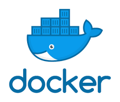

      
 
# Welcome to the Hack Shack
Powered by [HPE DEV Team](https://hpedev.io)

<p align="center">
  
  
</p>

# Workshops-on-Demand

# Introduction to Docker 101
In this workshop we’ll go through the understanding of Containers and Docker, from basic concepts up to running a full Web based application containerized

# Authors: [Bruno Cornec](mailto:bruno.cornec@hpe.com) & [Rene Ribaud](mailto:rene@flossita.org) & [Frederic Passeron](mailto:frederic.passeron@hpe.com)

## Handouts
You can freely copy the Jupyter Notebooks, including their output, in order to practice back at your office at your own pace, leveraging a local installation of Jupyter Notebook on your laptop.
- You install the Jupyter Notebook application from [here](https://jupyter.org/install). 
- A Beginners Guide is also available [here](https://jupyter-notebook-beginner-guide.readthedocs.io/en/latest/what_is_jupyter.html)

## Objectives of the Docker Lab
At the end of the Lab students should be able to install Docker, use the CLI to create a new image, a container, launch an application in it, store data, configure the network.

This Lab is intended to be trial and error so that during the session students should understand really what is behind the tool.  Blindly following instructions is not an effective way to learn IMHO. You've been warned ;-)

Expected duration : 120 minutes

## Reference documents
When dealing with the installation and configuration of Docker, the first step  is to check the reference Web site http://docker.io/:

At the start of each section there is an estimate of how long it will take to complete.


## Lab flow
HackShack Workshops are delivered through a central point that allows a portable, dynamic version of the lab guides. Rather than using standard PDF files which always end in copy / paste errors from the lab guide into the TS sessions, this year we decided to innovate and introduce a brand-new infrastructure. We will leverage a JupyterHub server on which all the different lab guides will be stored in a notebook format (*.ipynb).

In a nutshell, a notebook works as follows:

• A Notebook is a series de cells

• Notebook uses a kernel (visible in the upper right corner of the Notebook)

• Cell can be Markdown or Code (in the selected kernel)

• To Run a cell use:

    o The Play Button at the top
    o Ctrl-Enter (run and stay on same cell)
    o Shift-Enter (run and move to next cell)
    
• Running a markdown cell is just rendering it

• Running a Code cell runs the code and display the output just below the cell

• When a cell is running it displays a [*] to its left, then when finished, it displays a counter of the number of execution of that cell

• You cannot run a cell when another is already running but you can interrupt a running cell with the stop button

Enjoy the labs ! :-)

## Workflow

### Lab 1: Introduction to container technology
Description: In this section, we’ll go through some of the basics concepts around Docker (Docker Engine,Docker Compose, Docker Machine, andDocker Swarm)
* [Lab 1](1-WKSHP-Intro-to-Containers-techno.ipynb)

### Lab 2: Using Docker
Description: In this section, you will create your first containers.
* [Lab 2](2-WKSHP-Using-Docker.ipynb)

### Lab 3: Using Dockerfile
Description: In this section, we’ll go through some of the necessary steps to configure nextcloud in a container
* [Lab 3](3-WKSHP-Using-Dockerfile.ipynb)

### Lab 4: Using Docker Compose
Description: In this section, we’ll go through some of the necessary steps to configure a multi tiered app leveraging Docker Compose functionnalities
* [Lab 4](4-WKSHP-Using-Docker-Compose.ipynb)

### Conclusion
* [Conclusion](5-WKSHP-COnclusion.ipynb)

# Thank you!


```python

```
