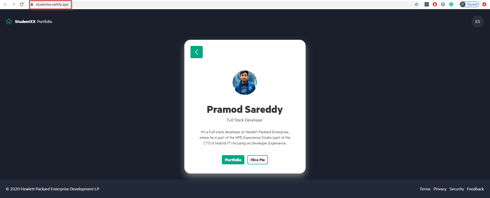

{{ BRANDINGLOGO }}

# Welcome to the {{ BRANDINGWOD }} Hack Shack
[{{ BRANDING }} Community Team]({{ BRANDINGURL }})

  
  

# Workshops on Demand

# Introduction to Grommet and Grommet Designer hands-on workshop

# Author: [Pramod Reddy](mailto:pramod-reddy.sareddy@hpe.com)

**Grommet** is a React component library that provides responsive and accessible mobile-first code components you can easily use for your projects.

Visit the [Grommet v2](https://v2.grommet.io) website for more information.

**Grommet Designer** is a tool to design screens using grommet components.
Live at: [designer.grommet.io](https://designer.grommet.io/)

This workshop focuses on how developers/designers can use Grommet and Grommet Designer, to quickly design/develop their web applications, generate the code from the design, push the source code to GitHub and deploy it on netlify.

You will get started with some fundamental knowledge about how to design a web application, for example, your Bio with the Grommet Designer. We walk you through, step by step, and, by the end of the session, you'll be deploying your own Bio application in netlify and access from the internet anytime. 

## Lab Goal

At the end of the workshop, you will be able to 
  * Explain what is Grommet?
  * Explain why it is used?
  * Create/design your own web application using [Grommet Designer](https://designer.grommet.io/)
  * Generate the Source code from the design
  * Push the source code to GitHub
  * Deploy it to netlify and access from the internet
  

# Lab Flow
{{ BRANDINGWOD }} Workshops-on-Demand are delivered through a central point that allows a portable, dynamic version of the lab guides. We are now leveraging a jupyterhub server on which all the different labs guides will be stored in a Notebook format (*.ipynb). These Notebooks are accessible from the internet for the event.

Besides, the notebooks can be downloaded on to your own laptop for further usage or edition. In order to use them, you will need to install the jupyter notebook application available [here](https://jupyter.org/install).
Beginners guide available [here](https://jupyter-notebook-beginner-guide.readthedocs.io/en/latest/what_is_jupyter.html)

In a nutshell, a notebook works as follows:

• A Notebook is a series de cells

• Notebook uses a kernel (visible in the upper right corner of the Notebook)

• Cell can be Markdown or Code (in the selected kernel)

• To Run a cell use:

    o The Play Button at the top
    o Ctrl-Enter (run and stay on same cell)
    o Shift-Enter (run and move to next cell)
    
• Running a markdown cell is just rendering it

• Running a Code cell runs the code and display the output just below the cell

• When a cell is running it displays a [*] to its left, then when finished, it displays a counter of the number of execution of that cell

• You cannot run a cell when another is already running but you can interrupt a running cell with the stop button

Happy labs! :-)

# Documentation and Tools

All you need is a laptop or workstation with a chrome/firefox/safari browser.

We use Grommet designer to design the application and install nodejs, yarn, git on your workstation to run the application locally, push the code to your GitHub repo and deploy it on Netlify to access it from the internet.

Visit below links to find information about Grommet and Grommet Designer.

- Visit the [Grommet v2](https://v2.grommet.io) website for more information on Grommet.
- Visit the [Grommet Designer](https://designer.grommet.io/) website to start creating designs with grommet components.
- Visit the [Grommet Components](https://v2.grommet.io/components) website for Grommet components.
- Visit the [Grommet Storybook](https://storybook.grommet.io/) website for examples of Grommet components.
- Visit the [Grommet Code Sandbox](https://codesandbox.io/u/grommetux/sandboxes) website for Grommet sandboxes.

The hands-on lab exercises have been designed to run in the order below:

# Lab 1: Introduction

In this intro, we'll learn about what is Grommet and Grommet designer? How it will be helpful in designing and developing your own web applications.

* [Lab 1](1-WKSHP-Introduction.ipynb)

# Lab 2: App design in Grommet Designer

In this lab, we'll use Grommet Designer to design the Bio application and apply different themes like HPE, Grommet, etc and modes like Dark and Light.

* [Lab 2](2-WKSHP-DesignApp.ipynb)

# Lab 3: Prepare Environment

In this lab, we'll prepare the local environment by installing nodejs and yarn to run the web application locally and push the code to the GitHub repository.

* [Lab 3](3-WKSHP-PrepareEnvironment.ipynb)

# Lab 4: Deploy your App to Netlify

In this lab, we'll connect your GitHub repo to netlify to deploy the application and access it from the internet.

* [Lab 4](4-WKSHP-DeploytoNetlify.ipynb)

# Thank You!

