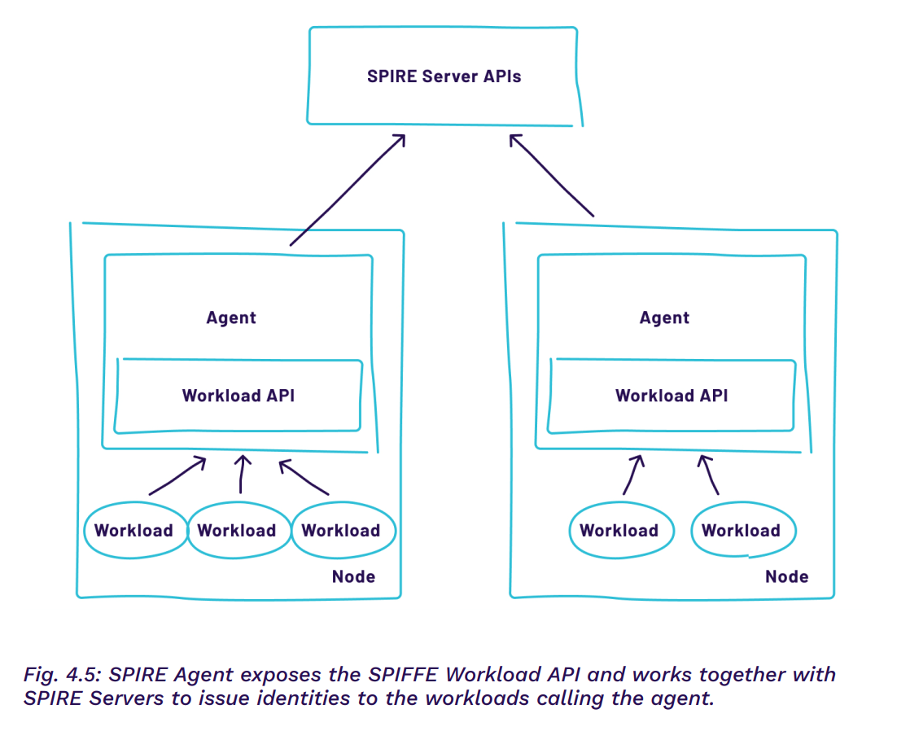
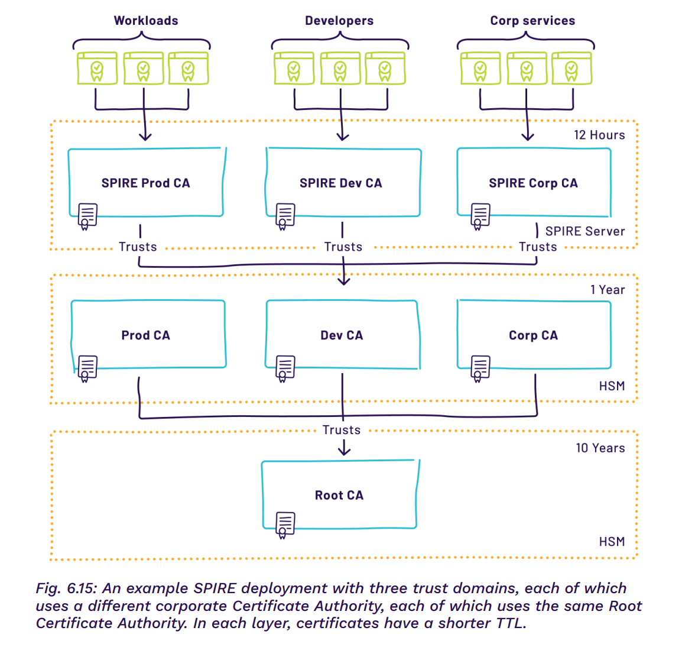
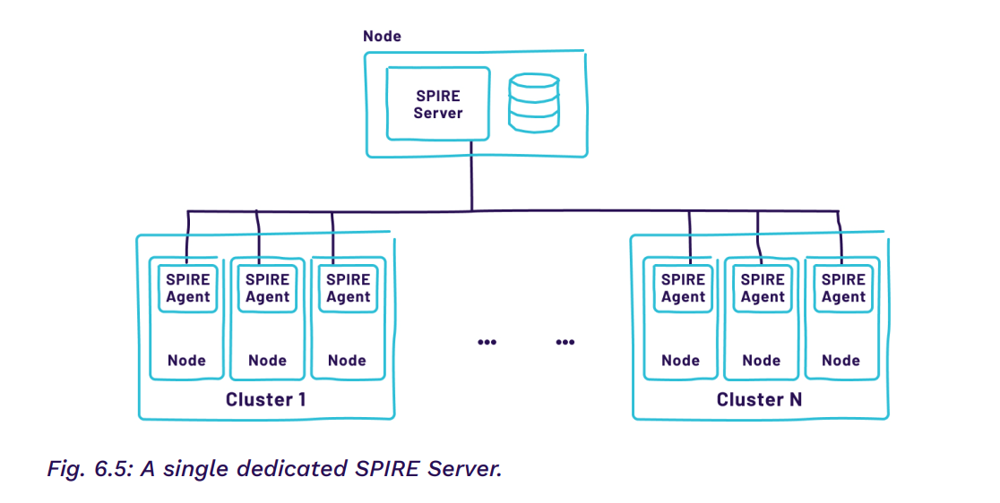
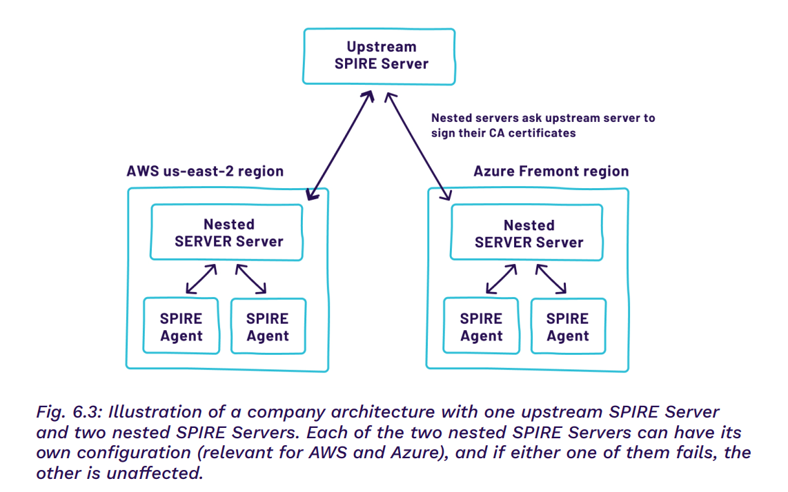

# Welcome to the Hack Shack
Powered by [HPE DEV Team](https://hpedev.io)

  
  

# HPE DEV Workshops-on-Demand

# Introduction to SPIFFE/SPIRE
SPIFFE, the Secure Production Identity Framework for Everyone, is a set of open-source standards for securely identifying software systems in dynamic and heterogeneous environments.

Enterprise application or software services are increasingly running across multiple platforms spanning multiple data centers and public clouds. Since these services span various domains, the most efficient way to secure them is by a Zero Trust model. In this model, nothing is taken for granted, and every request has to be verified. Service identity and authentication is perhaps the most fundamental piece of building Zero Trust environments.

If not done right and early, it could undermine your efforts to enable Zero Trust in your organization and introduce risk, complexity, and slow down development velocity.

CNCF’s SPIFFE and SPIRE projects provide a universal service identity plane managing identity and trust within a zero trust security model. These projects provide a system for service to identify and authenticate themselves without the use of shared-secrets or network base security controls. Systems that adopt SPIFFE can easily and reliably mutually authenticate wherever they are running.

This workshop will introduce SPIFFE and SPIRE concepts, and demonstrate several simple use cases.

# Author: [Didier Lalli](mailto:didier.lalli@hpe.com)

## Handouts
You can freely copy the Jupyter Notebooks, including their output, in order to practice back at your office at your own pace, leveraging a local installation of Jupyter Notebook on your laptop.
- You install the Jupyter Notebook application from [here](https://jupyter.org/install). 
- A Beginners Guide is also available [here](https://jupyter-notebook-beginner-guide.readthedocs.io/en/latest/what_is_jupyter.html)

## Lab flow
HackShack Workshops are delivered through a central point that allows a portable, dynamic version of the lab guides. Rather than using standard PDF files which always end in copy / paste errors from the lab guide into the TS sessions, this year we decided to innovate and introduce a brand-new infrastructure. We will leverage a JupyterHub server on which all the different lab guides will be stored in a notebook format (*.ipynb).

In a nutshell, a notebook works as follows:

• A Notebook is a series de cells

• Notebook uses a kernel (visible in the upper right corner of the Notebook)

• Cell can be Markdown or Code (in the selected kernel)

• To Run a cell use:

    o The Play Button at the top
    o Ctrl-Enter (run and stay on same cell)
    o Shift-Enter (run and move to next cell)
    
• Running a markdown cell is just rendering it

• Running a Code cell runs the code and display the output just below the cell

• When a cell is running it displays a [*] to its left, then when finished, it displays a counter of the number of execution of that cell

• You cannot run a cell when another is already running but you can interrupt a running cell with the stop button

Enjoy the labs ! :-)

## Workflow

### Lab 1: SPIRE Fundamentals

* [Lab 1](1-WKSHP-SPIRE-Lab1.ipynb)

# Thank you!

